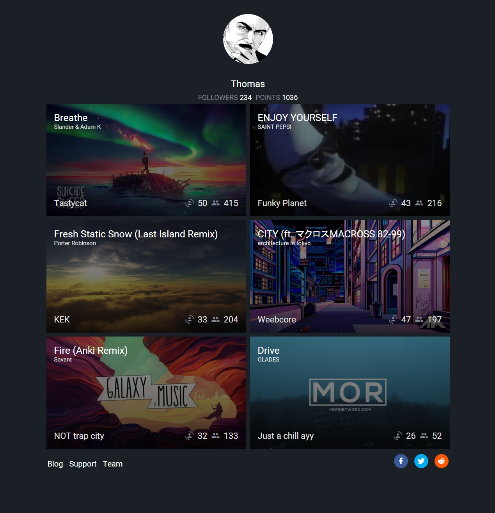

# Phynix
Phynix was a [Plug DJ](https://en.wikipedia.org/wiki/Plug.dj) alternative, and
the successor to [TurnFM](https://np.reddit.com/r/turnfm) after a dispute
between the founders. It made it to the final stages of development, but due to
lack of interest and time, it was never launched.

Phynix was hosted on [phynix.io](https://phynix.io), but has not been renewed.

This repository serves as an archive for the final state of the project. The
original, untouched source can be found on the [archive branch](/uhthomas/phynix/branches/archive).

## Involvement
There was lots of involvement from previous members of the Plug DJ, but Phynix
had a core team which all fulfilled their own roles for the project.
* Adis Basic
* Cornelia
* Kasper
* Vincent

## Screenshots

### Dashboard

